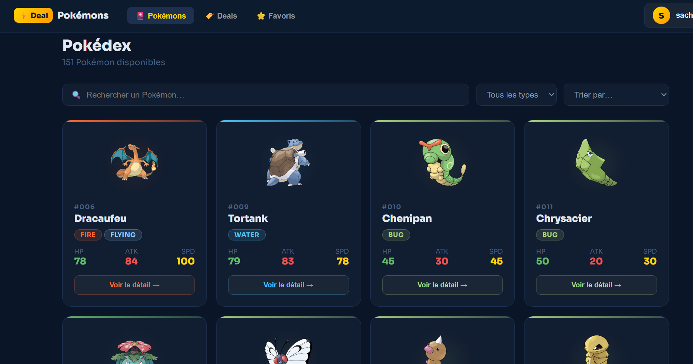
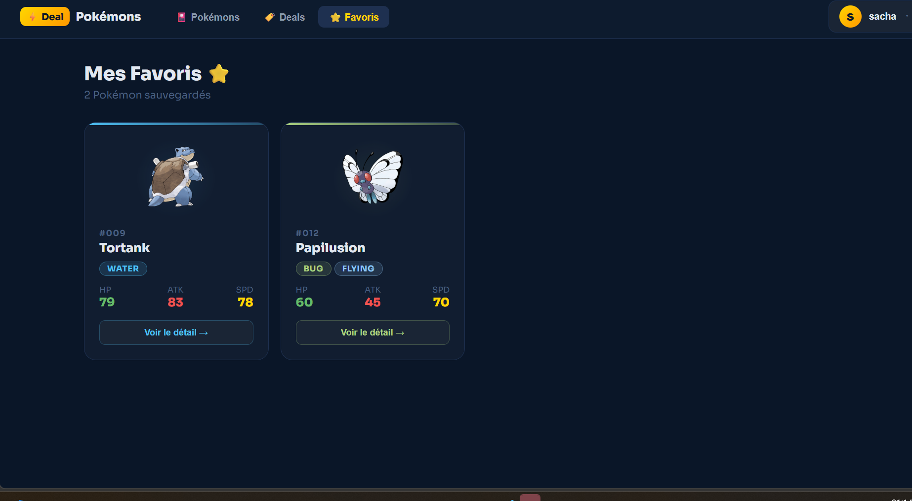
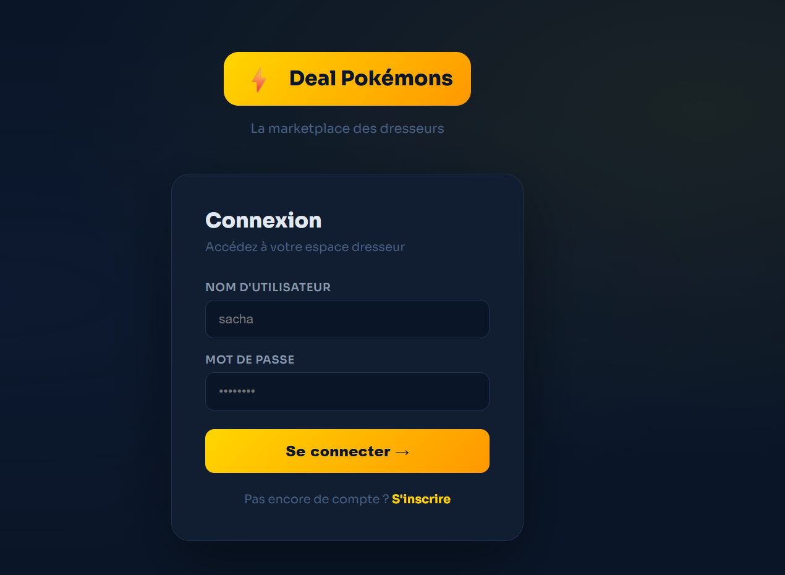
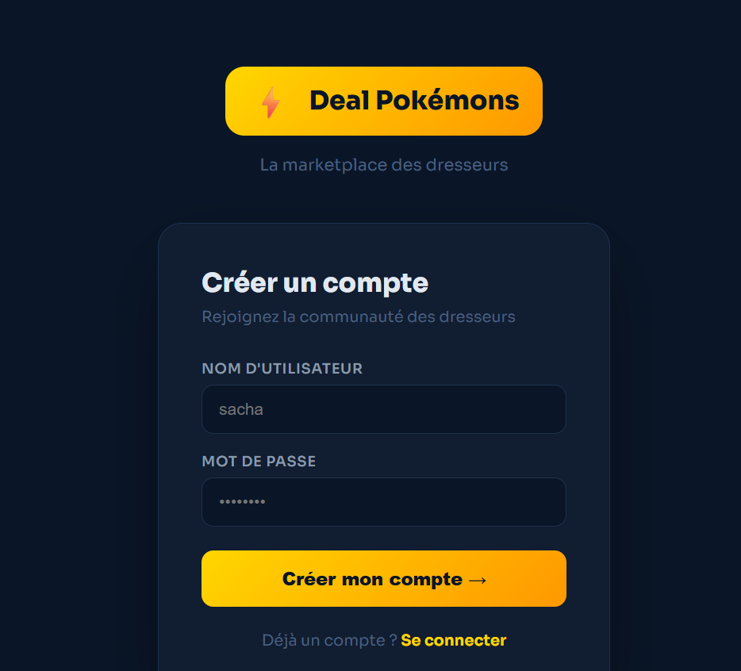
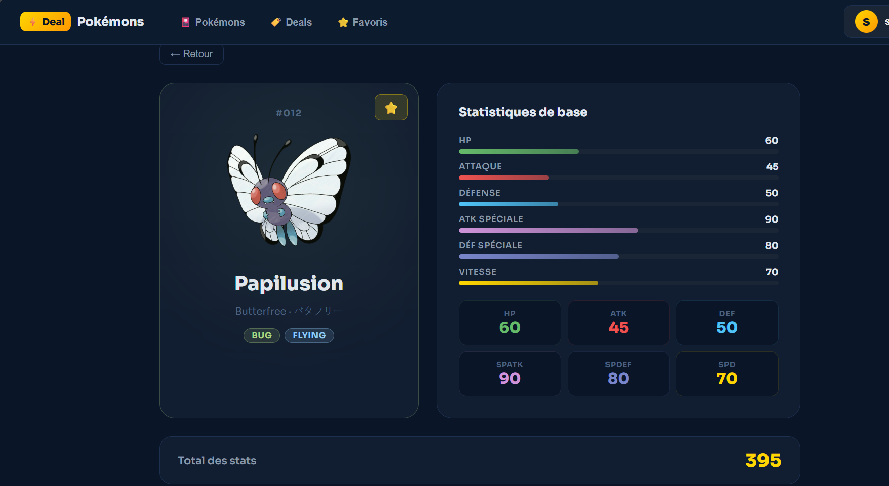
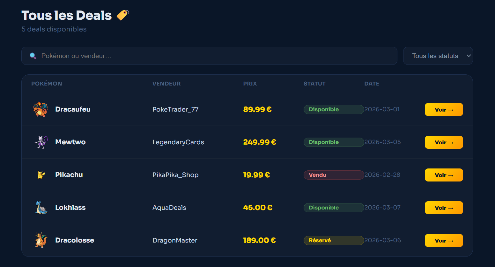
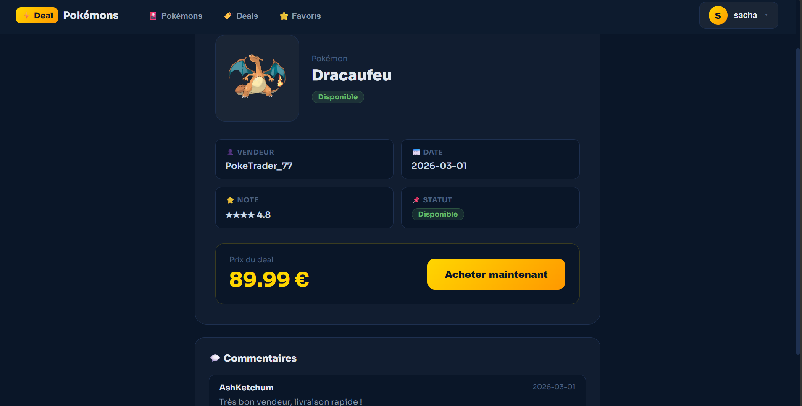

# API Pokémon & MongoDB — TP NoSQL

**Auteur : Tagne Ashley**

Ce dépôt contient une **API REST Express.js** avec les **151 Pokémon** de la première génération, connectée à **MongoDB**. Le but du projet est de construire une API complète (CRUD, recherche, filtrage, pagination, auth JWT, favoris, stats...) à partir d'un point de départ où la donnée existe seulement dans un fichier JSON.

---

## ✅ Contenu du projet

- `index.js` : point d'entrée du serveur Express
- `routes/` : définition des routes API (pokémons, auth, favoris, stats, équipes...)
- `models/` : modèles Mongoose (`Pokemon`, `User`, `Team`, ...)
- `db/` : connexion MongoDB + script de seed
- `data/` : données de base (`pokemons.json`, `pokemonsList.js`)
- `middleware/` : middlewares (auth JWT, etc.)

Le workspace contient aussi un sous-projet frontend (`deal-pokemons/`) qui consomme l'API.

---

## 🔧 Prérequis

- Node.js (v18+)
- MongoDB local (`mongod`) ou MongoDB Atlas (cluster gratuit)
- Un outil pour tester les requêtes (Thunder Client, Postman, curl...)

---

## 🚀 Installation

```bash
# Cloner le projet (votre prof vous donnera l'URL)
git clone 
cd tp-nosql-ashley28ashley

# Installer les dépendances
npm install
```

### Configuration

```bash
cp .env.example .env
```

- Vérifiez que `MONGODB_URI` pointe vers votre MongoDB.
- Ajoutez `JWT_SECRET` pour signer les tokens.

---

## 🧪 Initialiser la base de données (seed)

Ce script importe les 151 Pokémon de `data/pokemons.json` vers MongoDB.

```bash
npm run seed
```

✅ Vérification (dans `mongosh`) :

```js
db.pokemons.countDocuments()   // 151
db.pokemons.findOne({ id: 25 }) // Pikachu
```

---

## 🏃‍♂️ Lancer l'API en mode dev

```bash
npm run dev
```

Le serveur démarre par défaut sur :

```
http://localhost:3000
```

---

## 🧭 Endpoints principaux

### Auth

- `POST /api/auth/register` — créer un utilisateur
- `POST /api/auth/login` — se connecter et récupérer un JWT

### Pokémon

Les routes `POST`, `PUT` et `DELETE` sont protégées (JWT requis).

- `GET /api/pokemons` — lister (filtre, tri, pagination)
- `GET /api/pokemons/:id` — récupérer un Pokémon par son `id`
- `POST /api/pokemons` — créer un nouveau Pokémon (auth)
- `PUT /api/pokemons/:id` — modifier un Pokémon (auth)
- `DELETE /api/pokemons/:id` — supprimer un Pokémon (auth)

#### Paramètres de requête utiles

- `type` : filtrer par type (`?type=Fire`)
- `name` : recherche insensible à la casse (`?name=char`)
- `sort` : tri (`?sort=name.french`, `?sort=-base.HP`)
- `page` et `limit` : pagination (`?page=2&limit=20`)

---

## ⭐ Fonctionnalités avancées implémentées (toute la partie 6)

- Authentification JWT (routes protégées)
- Système de favoris pour chaque utilisateur
- Statistiques avancées (agrégations MongoDB)
- Validation avancée des données (types, stats, id, messages en français)
- Gestion d'équipes Pokémon (CRUD, population des documents)

---

## 🧠 Structure rapide du backend

```text
index.js
│
├── db/
│   ├── connect.js
│   └── seed.js
├── models/
│   ├── pokemon.js
│   ├── user.js
│   └── team.js
├── routes/
│   ├── pokemons.js
│   ├── auth.js
│   ├── favorites.js
│   ├── stats.js
│   └── teams.js
├── middleware/
│   └── auth.js
└── data/
    ├── pokemons.json
    └── pokemonsList.js
```

## 💻 Frontend (Deal Pokémon)

Le dossier `deal-pokemons/` contient une application React/Vite qui consomme l'API et propose :

- **Pokédex** : recherche, filtres et tri sur les Pokémon
- **Deals** : liste des offres (prix, vendeur, statut)
- **Favoris** : enregistrer des Pokémon préférés (auth requise)
- **Authentification** : inscription / connexion + stockage du token JWT

### 🎯 Touche perso — DealPage & Deal Detail

La vraie valeur ajoutée de ce projet se trouve dans la page **Deals** et la page **Détail d’un deal** :

- **DealPage** : tableau interactif avec filtre par statut, recherche, et navigation vers chaque deal
- **DealDetail** : vue détaillée d’une offre (prix, vendeur, note, commentaires) + bouton d’achat

> 💡 C’est ce que j'ai construit moi-même pour rendre l’application plus “marketplace” et immersive.

### Lancer le frontend

```bash
cd deal-pokemons
npm install
npm run dev
```

---

## 🖼️ Aperçu de l'interface

Voici quelques captures d'écran de l'application :









---

## 🔍 Notes & conseils

- Avant de lancer le serveur, assurez-vous que MongoDB est démarré.
- Si vous changez `MONGODB_URI`, relancez le serveur pour que la connexion se fasse avec la nouvelle URL.
- Pour tester les routes protégées, ajoutez l'entête :

```
Authorization: Bearer <token>
```

---

Bonne exploration ! 🎮
